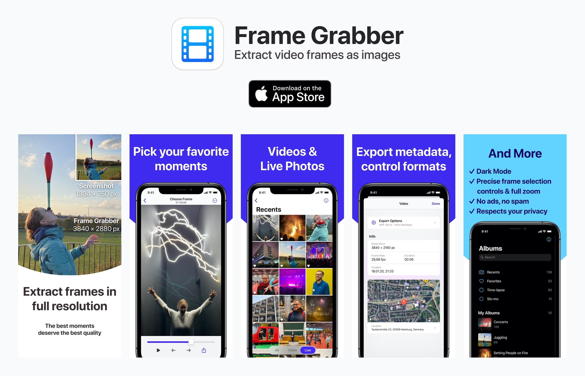

Frame Grabber is an iOS app that lets you extract full-resolution video and Live Photo frames as images. [You can get it on the App Store here](https://apps.apple.com/app/frame-grabber/id1434703541).

Unlike screenshots, images extracted with Frame Grabber have full resolution, contain video metadata and much more! Perfect to save your favorite video moments to your photo library or to share them on social media.

## Features

- Quick and easy
- Export frames in full resolution and quality
- Works with videos and Live Photos
- Export metadata like creation date and geolocation
- Exact frame-by-frame selection and full zoom to find the perfect moment
- Control the export format (JPG, HEIF) and compression quality

Frame Grabber is completely free and respects your privacy.

## About

Frame Graber is my first app!

I made it primarily for two reasons: One, because I've wanted an app like this for the longest time. And two, because it seemed like the perfect project in size to finally learn iOS development and Swift.

I tried to make the app polished and smooth for the user. Besides the UIKit stack in general, there were tons of challenges and things I learned along the way:

- Designing a smooth UI/UX
- Implementing custom, interactive transitions
- Implementing custom controls
- Efficiently generating large numbers of video frames
- Efficiently filtering PhotosKit photo albums
- Implementing In-App-Purchases with StoreKit
- And loooots more!

Feedback is highly appreciated! [Try Frame Grabber on the App Store](https://apps.apple.com/app/frame-grabber/id1434703541) and tell me what you think.

## Development

Open the project in Xcode and build. The app has no dependencies.

## License

See [LICENSE](LICENSE).
