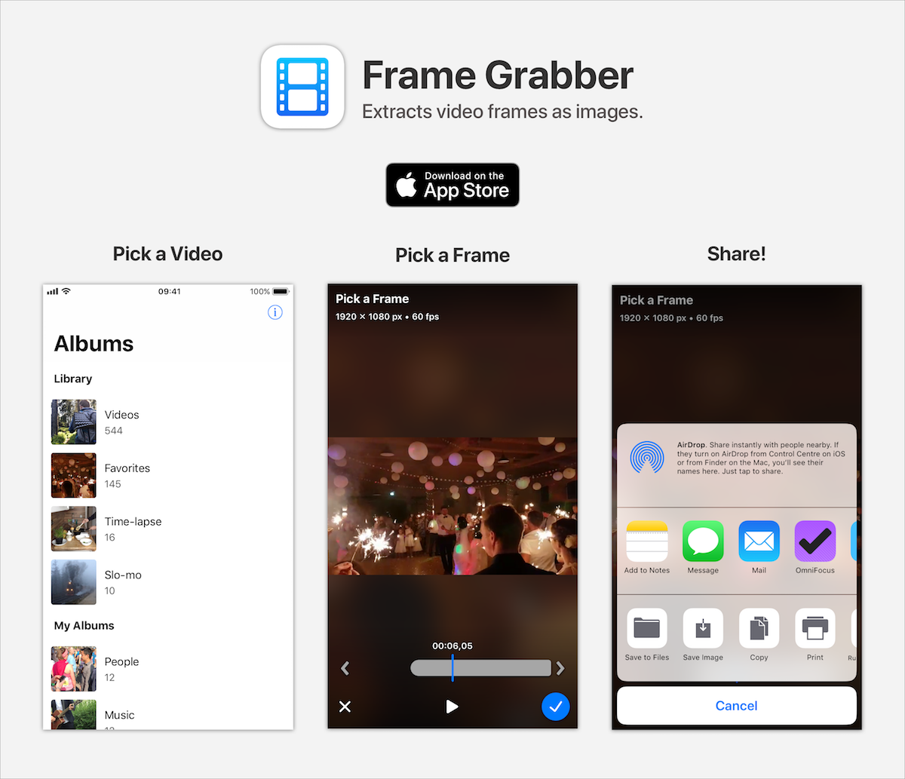

[Frame Grabber](https://itunes.apple.com/us/app/frame-grabber/id1434703541?ls=1&mt=8) is a simple iPhone app that lets you extract video frames as images. You can use it to save favorite moments in your videos as still images or share them to social networks.

This is my first iOS app! I made this to learn Swift and iOS development. Thanks for checking it out.

Feedback welcome. 👍

## Features

- Quick and easy to use.
- Precision frame by frame stepping.
- Zooming for details.
- Includes metadata such as creation date and location in exported frames.
- Free and ad-free.

## Building the App

The app has no dependencies. Open the project in Xcode and build (Xcode 9+, Swift 4.1+).

## License

See [LICENSE](LICENSE).
