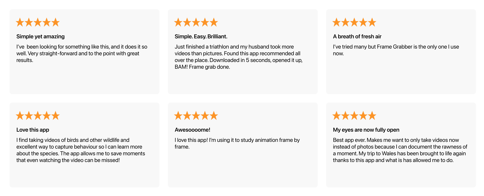

    

[Frame Grabber](https://framegrabberapp.com) is an app for iOS & iPadOS to extract full-resolution video frames as images — [framegrabberapp.com](https://framegrabberapp.com)

## Reviews

4.8 stars worldwide. Loved by users for its ease-of-use and intuitiveness.

    

## Open Source 

Open-sourced to give everything I learned back to the community.

## About

[Read more](./docs/about.md) about why I made the app and some technical challenges along the way.

## How to Build

- Open Xcode
- Change development team and bundle identifier
- Build

## Project Setup

As I wanted to learn the fundamentals with this project, I followed Apple's basic documentation. Which meant MVC with storyboards at the time.

Overview of main components:
- [`Application`](Frame%20Grabber/Application): Entry point into the app
- [`Scenes`](Frame%20Grabber/Scenes):The app's main screens
- [`Packages`](Frame%20Grabber/Packages): Modules extracted so far

> **Note**  
> This was my very first app without prior experience. Keep that in mind when checking out the code 😉 

## License

See [`LICENSE`](LICENSE).

Please [don't publish a clone](https://github.com/arthurhammer/FrameGrabber/issues/5) to the App Store. It's very confusing for users.
Instead, play around with the code, learn from it, and create something new! Make your ideas happen 🤗
